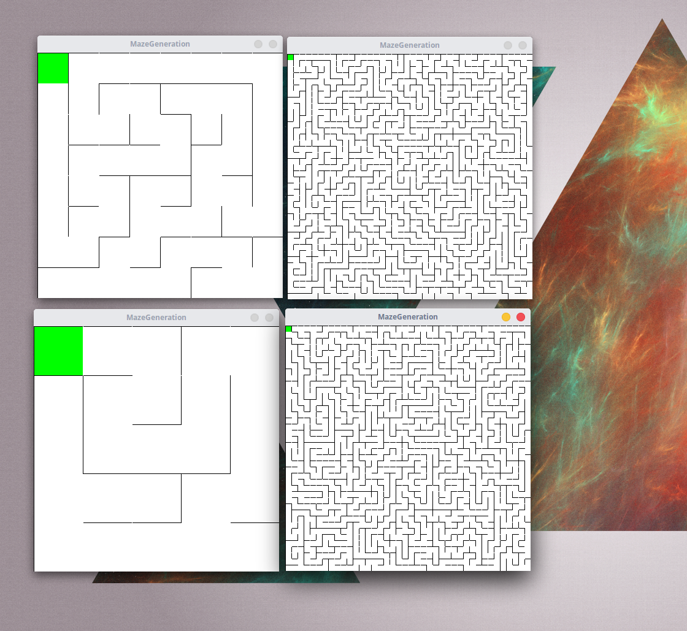
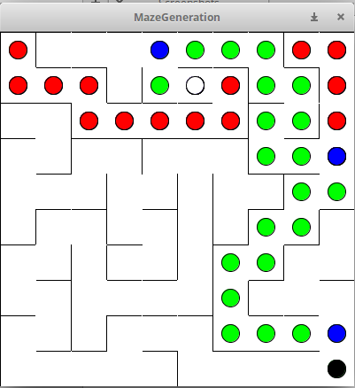

# MazeGeneration

A C program that generates random mazes using depth-first search and visualizes the solving process using the Stanford Portable Library (SPL).

## Overview

This project creates perfect mazes (mazes with a single solution path and no loops) using a recursive backtracking algorithm. After generation, it demonstrates the maze-solving process with color-coded visualization, showing how the algorithm explores paths and handles dead ends.

## Features

- **Dynamic Maze Generation**: Creates random 20×20 mazes using depth-first search with backtracking
- **Visual Solution Path**: Demonstrates the solving algorithm with animated, color-coded cells
- **Perfect Maze Algorithm**: Guarantees a unique solution path from start to finish
- **Interactive Graphics**: Real-time visualization using the Stanford Portable Library

## Maze Generation

The program uses a depth-first search algorithm to carve passages through a grid of cells:

1. Start with a grid where all cells have four walls
2. Randomly select unvisited neighboring cells
3. Remove walls between the current cell and chosen neighbor
4. Continue until all cells have been visited
5. Backtrack when no unvisited neighbors remain



The image above shows the progression of maze generation from a simple structure to a complex, fully-generated maze.

## Maze Solving

The solver navigates from the starting point (top-left) to the ending point (bottom-right) using a wall-following algorithm with backtracking:

- Follows the available path when only one option exists
- Makes random choices when multiple paths are available
- Backtracks when encountering dead ends



### Color Legend

- **White dot**: Starting point (top-left corner)
- **Black dot**: Ending point (bottom-right corner)
- **Green dots**: Newly visited cells during the solving process
- **Blue dots**: Cells with multiple path options (random choice made)
- **Red dots**: Dead ends or cells where backtracking occurred

## Requirements

- C compiler with C11 support
- CMake 3.8 or higher
- Stanford Portable Library (SPL)

## Building and Running

```bash
# Create build directory
mkdir build
cd build

# Configure with CMake
cmake ..

# Compile
make

# Run the program
./MazeGeneration
```

## Technical Details

- **Grid Size**: 20×20 cells (400 cells total)
- **Window Size**: 400×400 pixels
- **Cell Size**: 20×20 pixels each
- **Algorithm**: Depth-first search with recursive backtracking
- **Data Structures**: Stack-based backtracking, grid array

## How It Works

### Cell Structure

Each cell maintains:
- Position coordinates (i, j)
- Four wall states (top, right, bottom, left)
- Visited flag for maze generation
- Start/end markers

### Generation Algorithm

The maze generator ensures every cell is reachable by systematically removing walls while maintaining the maze's integrity, creating a perfect maze with exactly one solution path.

### Solving Algorithm

The solver handles different scenarios:
- **1 open wall**: Follows the only available path
- **2 open walls**: Randomly selects one direction
- **3 open walls**: Randomly selects from available options
- **4 walls (deadlock)**: Backtracks to the previous cell

## License

This project is available for educational purposes.
